# НарядAI

**Наряд выдан — ИИ на контроле.**

Flutter-приложение для выдачи, выполнения и проверки ремонтных нарядов на предприятии «Костанайские минералы». Мастер назначает работу и контролирует смену; исполнитель ведёт свои наряды и отправляет отчёт. Сервер хранит данные, проверяет права, рассчитывает рейтинг и предоставляет AI-функции.

Основная платформа проверки — **Android**. Package name: **`kz.naryadai.app`**. Интерфейс поддерживает русский и казахский языки. Время предприятия — **UTC+5**.

## Содержание

- [Запуск для комиссии](#запуск-для-комиссии)
- [Тестовые аккаунты](#тестовые-аккаунты)
- [Сценарий проверки](#сценарий-проверки)
- [Рабочий процесс](#рабочий-процесс)
- [Экраны исполнителя](#экраны-исполнителя)
- [Экраны мастера](#экраны-мастера)
- [Firebase и уведомления](#firebase-и-уведомления)
- [При потере интернета](#при-потере-интернета)
- [Тесты и сборка APK](#тесты-и-сборка-apk)
- [Структура проекта](#структура-проекта)
- [Решение проблем](#решение-проблем)

## Запуск для комиссии

### Требования

- Flutter с Dart **`>=3.11.5 <4.0.0`**, согласно `pubspec.yaml`. Android-сборка проверялась на Flutter **3.47.5**, Dart **3.13.4**.
- Android Studio, Android SDK и Android SDK Command-line Tools.
- Совместимый JDK 17 или новее; можно использовать JDK из Android Studio.
- Android-телефон с USB-отладкой или Android-эмулятор. Для FCM выберите образ эмулятора **Google Play** с сервисами Google.
- Интернет для загрузки зависимостей, авторизации и работы с сервером.
- Телефон и пароль тестового аккаунта из таблицы ниже.

### Порядок запуска

Клонируйте репозиторий по предоставленной комиссии ссылке. Откройте каталог, содержащий `pubspec.yaml`. Все команды выполняются из него.

```sh
flutter --version
flutter doctor -v
flutter doctor --android-licenses
flutter pub get
flutter gen-l10n
flutter devices
```

Устраните ошибки Android toolchain из `flutter doctor`. Запустите эмулятор в Android Studio → Device Manager. Для телефона включите USB-отладку и подтвердите доступ компьютера.

Запустите приложение, подставив идентификатор из `flutter devices`:

```sh
flutter run -d <device-id>
```

Например:

```sh
flutter run -d emulator-5554
```

После сплаша введите телефон и пароль. Приложение получает роль с сервера и автоматически открывает интерфейс мастера или исполнителя. При восстановлении сессии загрузка начинается во время анимации сплаша.

Разрешите уведомления при запросе Android. Разрешения камеры/выбора изображений подтверждаются при использовании фотографий.

### Сервер

По умолчанию приложение подключается к:

```text
https://hackaton.fenixkst.kz
```

Отдельный локальный бэкенд для этого стенда не нужен. Адрес задан параметром `baseUrl` конструктора `AuthSession` в [auth_session.dart](lib/features/auth/data/auth_session.dart). Для другого стенда измените значение и перезапустите приложение. Настройка через `--dart-define=API_BASE_URL=...` в текущей версии не реализована.

Клиент использует REST API с JWT и Socket.IO. Бэкенд, база данных, серверный AI и отправка FCM развёрнуты отдельно. Их доступность обеспечивает команда бэкенда.

### Просмотр UI без серверного входа

```sh
flutter run -d <device-id> --dart-define=DEMO_MODE=true
```

В деморежиме заполните форму корректным номером и непустым паролем: вход переводит в интерфейс исполнителя без серверной авторизации. Его наряды берутся из локального демонстрационного хранилища. Этот режим подходит для просмотра UI, но не проверяет реальные push, права, AI и обмен между ролями. Для полноценной проверки мастера и исполнителя используйте обычный запуск.

## Тестовые аккаунты

Для входа используйте **телефон и пароль**. `login` указан как справочная метка аккаунта; в форме входа нужен телефон. Эти данные предназначены для тестового стенда и предоставлены для проверки проекта.

| Роль | ФИО | Телефон | Пароль | Login |
| --- | --- | --- | --- | --- |
| Мастер | Ковалёв Сергей Петрович | `+77000000004` | `230522` | `master2` |
| Исполнитель | Ахметов Ерлан Серикович | `+77000000101` | `029580` | `worker1` |
| Исполнитель | Жумабаев Данияр Ерланович | `+77000000102` | `616514` | `worker2` |
| Исполнитель | Петров Андрей Викторович | `+77000000103` | `435198` | `worker3` |
| Исполнитель | Сагинтаев Нурлан Маратович | `+77000000104` | `608245` | `worker4` |
| Исполнитель | Ким Вадим Олегович | `+77000000105` | `778010` | `worker5` |
| Исполнитель | Оспанов Бауыржан Канатович | `+77000000106` | `798817` | `worker6` |
| Исполнитель | Иванов Сергей Николаевич | `+77000000107` | `008636` | `worker7` |
| Исполнитель | Тулегенов Арман Болатович | `+77000000108` | `563857` | `worker8` |
| Исполнитель | Мухамеджанов Ержан Талгатович | `+77000000109` | `036991` | `worker9` |
| Исполнитель | Шевченко Олег Петрович | `+77000000110` | `976913` | `worker10` |
| Исполнитель | Касымов Руслан Айдарович | `+77000000111` | `859643` | `worker11` |
| Исполнитель | Абдрахманов Тимур Нурланович | `+77000000112` | `524646` | `worker12` |
| Исполнитель | Литвиненко Игорь Васильевич | `+77000000113` | `835042` | `worker13` |
| Исполнитель | Есенов Медет Жанатович | `+77000000114` | `088212` | `worker14` |
| Исполнитель | Смагулов Айбек Кайратович | `+77000000115` | `758888` | `worker15` |

Для проверки на двух устройствах войдите как мастер `master2` и исполнитель `worker1`. При создании наряда выберите Ахметова Ерлана Сериковича. Пароли с ведущим нулём (`029580`, `008636`, `036991`, `088212`) вводите полностью. Если пароль на стенде изменён, попросите актуальные данные у команды.

Роли руководителя и администратора предназначены для веб-интерфейса. Мобильный клиент принимает мастера и исполнителя. Не подбирайте пароли: после пяти неверных попыток сервер может ограничить вход на 15 минут.

## Сценарий проверки

Лучше использовать два телефона/эмулятора: первый для мастера, второй для исполнителя. На одном устройстве можно переключаться через «Профиль → Выйти», но исполнитель должен быть авторизован в момент назначения для получения push.

1. Войдите исполнителем. Проверьте имя в профиле, разрешите уведомления и сверните приложение.
2. На устройстве мастера откройте «Наряды → Новый наряд». Выберите участок, принадлежащее ему оборудование и нужного исполнителя. Укажите тип, приоритет, описание и будущий срок либо норматив. Назовите работу тестовой.
3. Выдайте наряд. Исполнитель получает push и видит назначение в своих нарядах. Нажатие уведомления открывает карточку.
4. Примите наряд. Принятие подтверждает получение; отдельная кнопка «Начать исполнение» переводит его в работу и запускает таймер. Если уже выполняется другая работа, поставьте новый наряд в очередь.
5. Приостановите работу с причиной и возобновите. Рабочий таймер и просрочка различаются: таймер суммирует интервалы работы, просрочка определяется сроком выполнения.
6. Нажмите «Исполнено». Заполните выполненные работы, код неисправности, материалы и количество, добавьте фотографии, если они обязательны. Отправьте на проверку.
7. Мастер проверяет отчёт и серверный AI-результат, затем возвращает на доработку с комментарием или закрывает наряд с оценкой.
8. Исполнитель открывает результат в истории и рейтинг в профиле. Проверьте смену периода, пояснение рейтинга и переключение языка.
9. Мастер отменяет оставшиеся активные тестовые наряды после демонстрации. Отдельные уведомления можно отметить прочитанными; удаления в текущем API нет.

Используйте выделенные тестовые данные, не изменяйте чужие рабочие наряды.

## Рабочий процесс

| Этап | Действие и результат |
| --- | --- |
| Выдача | Мастер создаёт наряд: номер, назначение, статус `ISSUED` |
| Подтверждение | Принятие → `ACCEPTED`, очередь → `QUEUED`, отказ с причиной → `REJECTED` |
| Работа | Начало → `IN_PROGRESS`, пауза с причиной → `PAUSED`, возобновление возвращает в работу |
| Отчёт | Исполнитель отправляет текст, код неисправности, материалы и фотографии |
| Проверка | Сервер обрабатывает отчёт; мастер проверяет результат |
| Доработка | Возврат → `REWORK`; исполнитель исправляет работу и отправляет отчёт повторно |
| Закрытие | Мастер закрывает наряд (`CLOSED`) с оценкой; результат доступен в истории |
| Отмена | Мастер отменяет активный наряд (`CANCELLED`), если работа больше не нужна |

Кнопки зависят от статуса, роли и принадлежности наряда. Сервер проверяет права. Исполнитель видит собственные назначения; общий экран уведомлений получает записи текущего пользователя.

## Экраны исполнителя

Снимки сохранены в [docs/screenshots/executor](docs/screenshots/executor). Это предоставленные реальные скриншоты, а не макеты. Цифры, имена и сроки отражают момент съёмки; отдельные элементы могли измениться в текущей версии.

### Мои наряды и история

«Мои наряды» показывает текущую работу, назначения и очередь, поиск, сроки и статусы. Очередь восстанавливает порядок постановки по событиям сервера. Просроченные работы выделяются цветом. Открытие карточки загружает подробности и доступные действия.

«История» отделяет завершённые, отменённые и отклонённые работы от активных. Есть поиск и фильтры. Карточки показывают рабочее время и оценку, если сервер передал эти данные. Экран результата содержит проверку, оценку, отчёт, материалы и сравнение фактического времени с нормативом. В переданном наборе отдельных снимков списков и результата нет.

### Выданный наряд и выполнение

| Назначение | В работе |
| --- | --- |
| 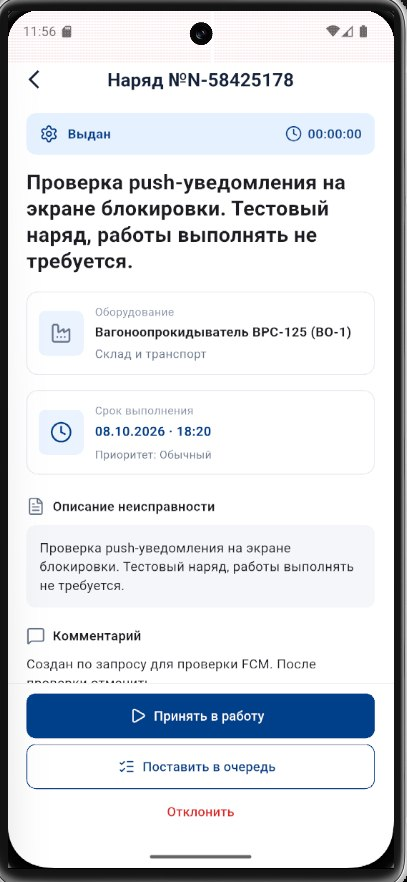 | 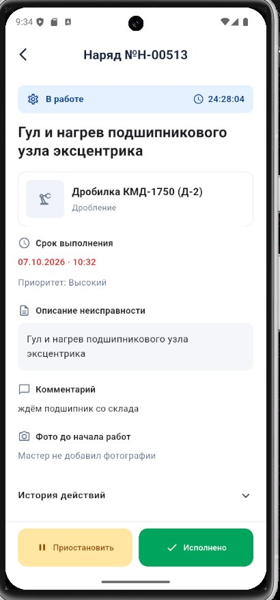 |

В карточке указаны номер, статус, таймер, оборудование, участок, срок, приоритет и описание. Выданный наряд можно принять, поставить в очередь или отклонить с причиной. Перед принятием/постановкой в очередь можно добавить необязательный комментарий. Комментарий мастера отображается отдельно.

Начатую работу можно приостановить с обязательной причиной и завершить. При наличии доступны фотографии до ремонта и история действий. При переназначении или потере доступа разрешённые действия обновляются.

### Отчёт о выполнении и материалы

| Отправка отчёта | Добавление материала |
| --- | --- |
| 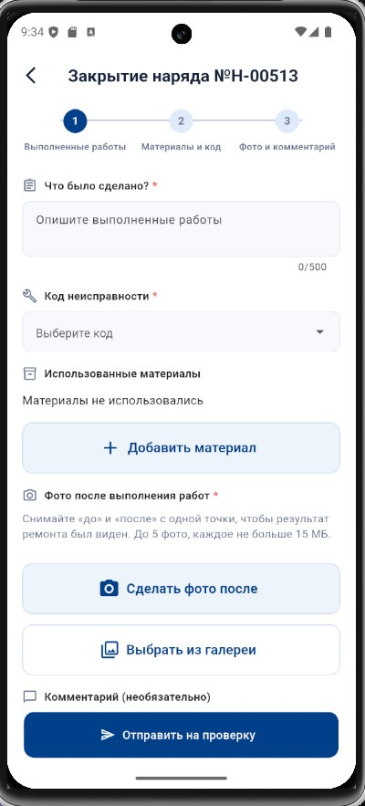 | 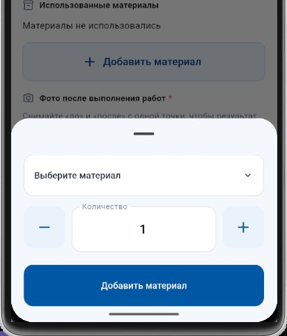 |

Форма завершения содержит описание выполненных работ, код неисправности из справочника, список материалов с количеством, фотографии после ремонта и необязательный комментарий. В нижней панели материала выбираются позиция и количество — вручную или кнопками «−»/«+». Единицы измерения берутся из справочника.

Снимки добавляются камерой или из галереи. Форма подсказывает ограничения: до пяти фотографий, каждая не больше 15 МБ. Обязательность фото зависит от типа наряда. Перед отправкой проверяются необходимые поля. Серверная AI-проверка может занять время; пока запрос выполняется, повторная отправка блокируется.

### Профиль и объяснение рейтинга

| Профиль | Пояснение рейтинга |
| --- | --- |
| 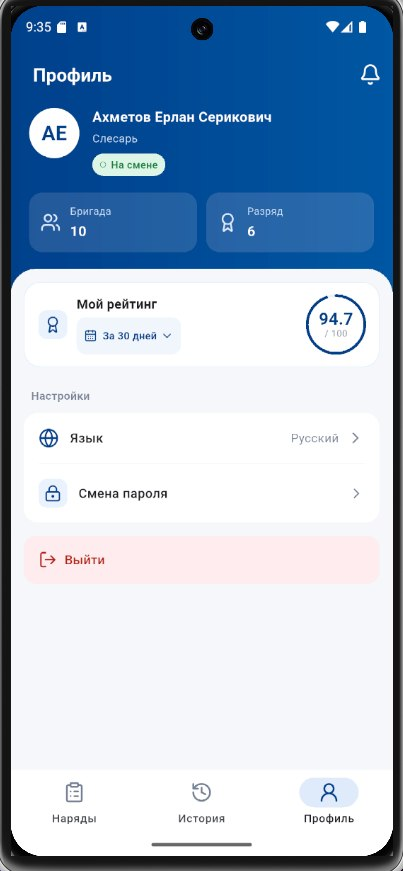 | 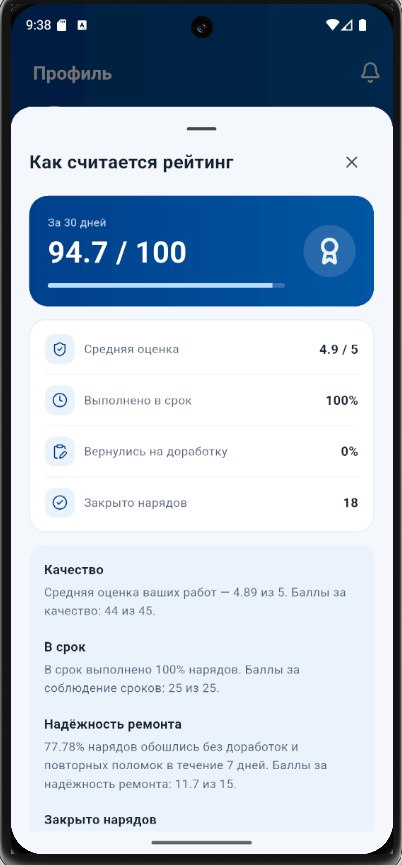 |

Профиль отображает имя, специальность, состояние смены, бригаду и разряд. Личный рейтинг приходит с сервера по 100-балльной шкале. Можно выбрать смену, день, неделю, 30 дней или произвольные даты. Нажатие на рейтинг открывает пояснение: среднюю оценку, выполнение в срок, доработки, закрытые наряды и вклад показателей в баллы. Оценка отдельного наряда по шкале 1–5 не равна всему рейтингу.

Настройки позволяют сменить русский/казахский язык, изменить пароль и выйти. Повторный предоставленный снимок сохранён отдельно: [дубликат профиля](docs/screenshots/executor/profile-duplicate.jpg).

### Уведомления исполнителя

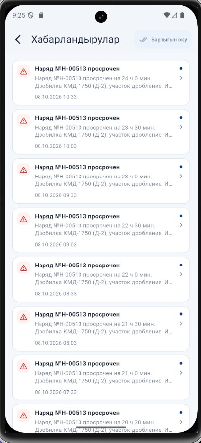

Список показывает назначения, напоминания о сроке, просрочки и бригадные события, адресованные исполнителю. Непрочитанные записи отмечены точкой. Нажатие отмечает уведомление прочитанным и открывает наряд. «Прочитать все» сразу обновляет отображение; обновление списка выполняется жестом pull-to-refresh. Повторные сообщения о просрочке каждые 30 минут предусмотрены сервером.

На казахском снимке часть текста русская: пользовательские комментарии и серверные сообщения сохраняют исходный язык. Переключение интерфейса не переводит произвольное содержимое наряда автоматически.

## Экраны мастера

Снимки сохранены в [docs/screenshots/master](docs/screenshots/master). На них навигация содержит «Смена», «Наряды», «Отчёты», «Чат», «Профиль». В текущем коде также есть «Команда», а ассистент расположен в разделе «ИИ»: набор вкладок на снимках относится к версии на момент съёмки.

### Обзор смены и создание наряда

| Обзор смены | Создание |
| --- | --- |
| 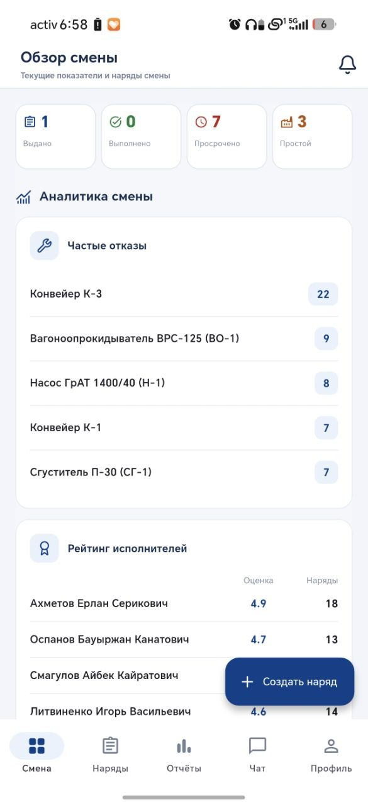 | 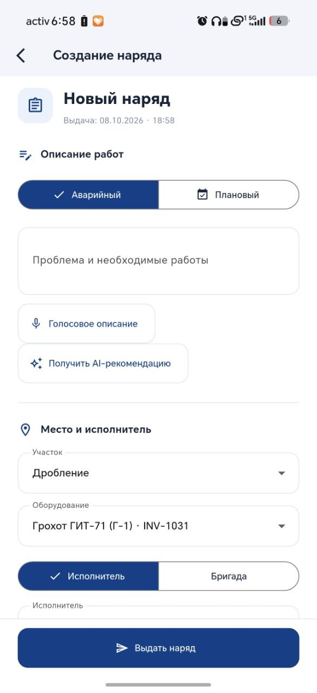 |

Обзор содержит показатели выдачи и выполнения, просрочки, простои, частые отказы и показатели исполнителей. Кнопка создания открывает форму нового наряда.

Мастер выбирает аварийный/плановый тип, описывает проблему, указывает участок и оборудование, назначает исполнителя либо бригаду, задаёт приоритет и срок/норматив. Справочники и рекомендации приходят с API. AI-рекомендация помогает подобрать данные, если серверная функция доступна. После выдачи наряд появляется в списках и отправляется адресату.

**Голосовой ввод:** на снимке есть кнопка, но в текущем коде формы создания она показывает сообщение о будущем подключении. Запись и расшифровка речи этой кнопкой пока не реализованы.

### Список и канбан

| Список | Канбан |
| --- | --- |
| 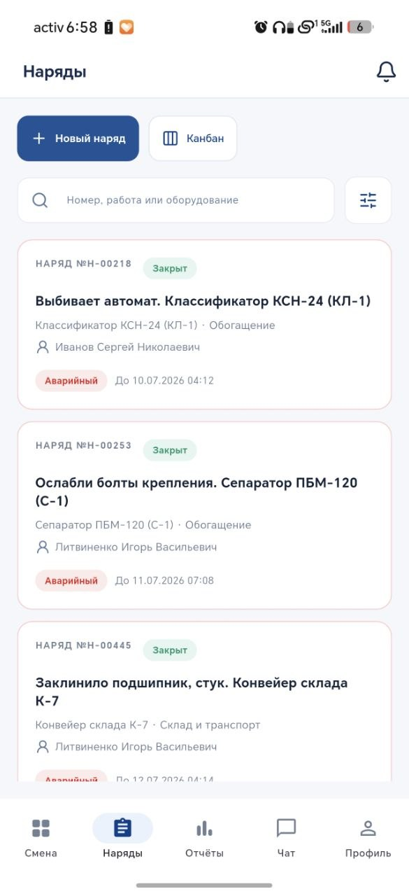 | 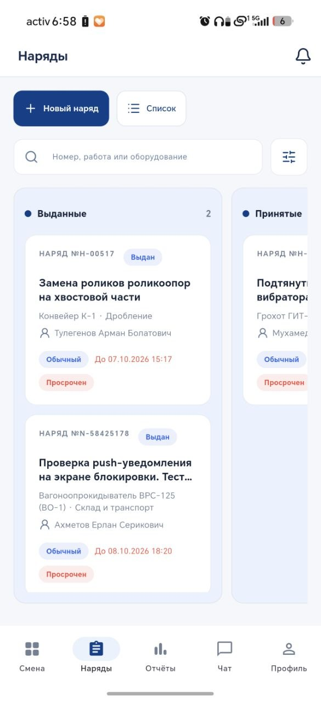 |

В списке можно искать наряды по номеру, работе и оборудованию и применять фильтры. Карточки содержат статус, исполнителя, оборудование, приоритет и срок. Переключатель открывает канбан: работы сгруппированы по статусам, колонки прокручиваются горизонтально. Нажатие карточки открывает подробности.

### Подробности наряда и команда

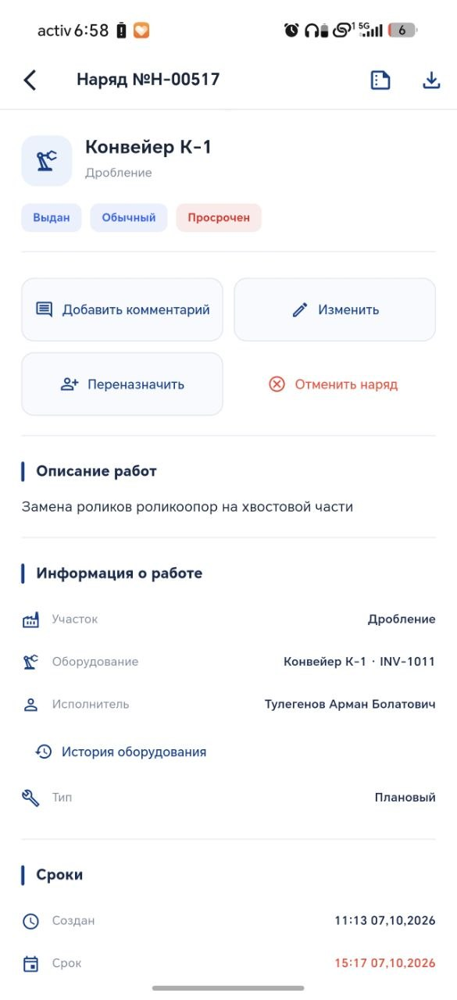

Подробности содержат описание, участок, оборудование, исполнителя, тип, сроки, фотографии и события. Мастер может добавить комментарий, изменить доступные параметры, переназначить активную работу или отменить её. Для отчёта на проверке доступны возврат на доработку и закрытие с оценкой. Отчёт и экспорт открываются соответствующими действиями при наличии серверных данных.

Раздел «Команда» показывает бригады и исполнителей. Состояния помогают выбирать адресата: свободен — зелёный, занят — жёлтый, есть очередь — синий, не на смене — серый. Отдельного снимка команды в предоставленном наборе нет.

### Отчёты и фильтры

| Параметры просмотра | Сравнение рейтингов |
| --- | --- |
| 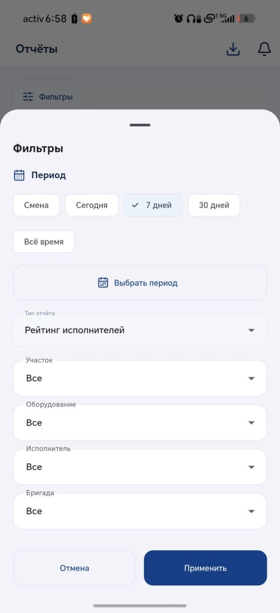 | 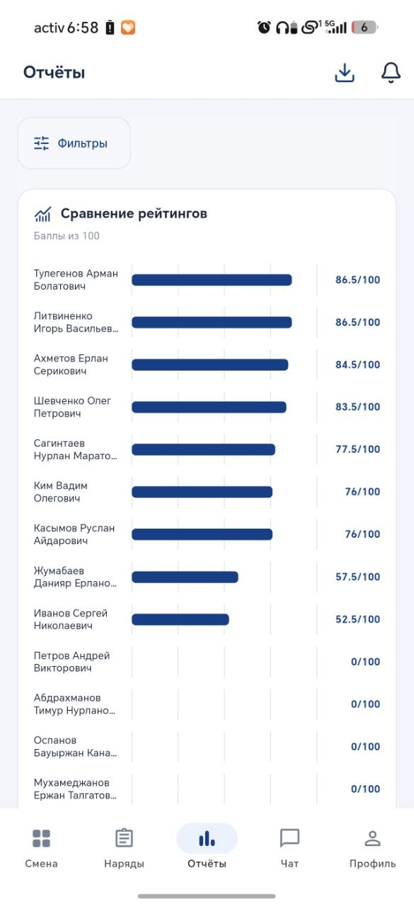 |

Отчёты показывают сводки и сравнение показателей. На снимке фильтры задают период, тип отчёта, участок, оборудование, исполнителя и бригаду. Диаграмма сравнивает рейтинги по 100-балльной шкале. API предоставляет сводку смены, рейтинги сотрудников и бригад, материалы, простои, отдельный наряд и экспорт PDF/XLSX. Результат зависит от серверных данных и прав пользователя.

### Ассистент и профиль

| Ассистент | Профиль |
| --- | --- |
| 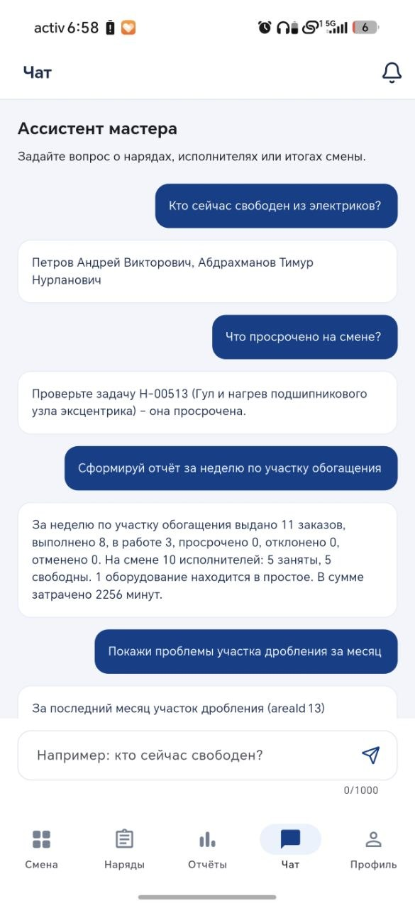 | 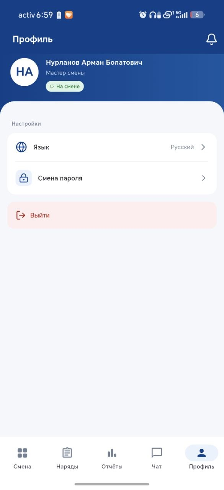 |

Ассистент отправляет вопрос через `POST /api/assistant/chat` и отображает серверный ответ. Можно спрашивать об исполнителях, назначениях, просрочках и итогах работы. Поддерживается загрузка истории общения. Для полноценной демонстрации нужен доступный серверный AI.

Профиль содержит личные сведения, состояние смены, выбор языка, смену пароля и выход. Личный рейтинг исполнителя не подменяется рейтингом мастера.

### Уведомления мастера

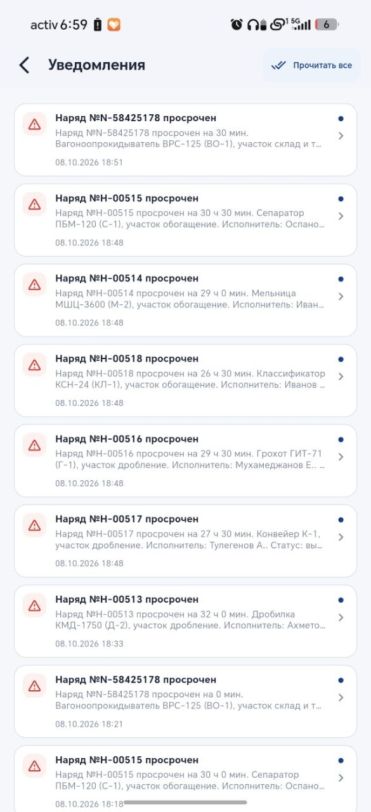

Используется общий экран уведомлений, но сервер возвращает сообщения мастера: контроль назначений, непринятого наряда и другие адресованные ему события. Записи мастера/руководителя не должны попадать исполнителю. Доступны отметка всех прочитанными, обновление жестом и переход к наряду.

## Firebase и уведомления

Есть два канала доставки: **список уведомлений/Socket.IO** и **системные push через FCM**. Запись может появиться внутри приложения без push, если Firebase не настроен.

1. Зарегистрируйте Android-приложение **`kz.naryadai.app`** в Firebase-проекте, из которого бэкенд отправляет push.
2. Поместите конфигурацию в **`android/app/google-services.json`**. В рабочем проекте файл подключён; для другой копии репозитория проверьте его наличие и правильный package name.
3. Пересоберите и установите приложение. Hot reload не подключает новую Android-конфигурацию.
4. Войдите и разрешите уведомления. Клиент получает FCM-токен и отправляет `POST /api/devices`.
5. На бэкенде настройте отправку из того же Firebase-проекта. Серверные ключи в мобильный репозиторий не помещаются.

При выходе токен отвязывается через `DELETE /api/devices/:token`. Обычные push используют канал `orders`. Аварийное новое назначение (`NEW_ORDER`, `EMERGENCY`) — `emergency_orders` с высокой важностью и отдельным звуком. Нажатие открывает наряд по `data.workOrderId`.

Чтобы проверить немедленно, войдите исполнителем, сверните приложение и выдайте ему новый тестовый наряд с аккаунта мастера. Не нужно ждать просрочки. Аварийный канал проверяется отдельным назначением. Для проверки блокировки включите сам экран блокировки на эмуляторе. Звук и видимость текста зависят также от настроек Android.

API возвращает последние 100 уведомлений и позволяет отметить их прочитанными. **Удаление отдельных уведомлений не поддерживается.**

## При потере интернета

Клиент сохраняет черновик отчёта исполнителя, выбранные фотографии и очередь действий на устройстве. При временной потере сети поддержанные действия сохраняются для повторной отправки. `clientActionId` предотвращает повторное применение действия сервером. После восстановления связи клиент повторяет отправку; фотографии загружаются перед завершением работы.

Справочники кэшируются и обновляются при входе. Сохранённый черновик не означает успешную отправку: до синхронизации серверное состояние может оставаться прежним.

**Полностью автономный запуск не реализован.** Проверка сессии при холодном старте и загрузка новых подробностей требуют сети. Полного постоянного кэша нарядов нет; несколько связанных переходов без серверного подтверждения могут быть недоступны. Проверяйте сохранение на уже открытой работе: отключите сеть, внесите отчёт/действие, восстановите связь и убедитесь в отправке.

## Тесты и сборка APK

```sh
flutter analyze
flutter test
flutter build apk --debug
```

Установка на выбранное устройство:

```sh
flutter install -d <device-id> --debug
```

Debug APK подходит для проверки комиссией. Для публикации нужна отдельная release-подпись: текущая release-конфигурация использует debug signing.

Автотесты покрывают авторизацию, API-действия, очередь и повторную отправку, локализацию, рейтинг, уведомления и навигацию. Unit/widget-тесты используют подменённые сервисы и не подтверждают доставку FCM. Реальные push, камера, загрузка фото и AI проверяются на устройстве с работающим сервером.

## Структура проекта

| Путь | Назначение |
| --- | --- |
| `lib/main.dart` | Точка входа и `DEMO_MODE` |
| `lib/app/` | Общая конфигурация, маршруты, сервисы и стартовая загрузка |
| `lib/core/api/` | HTTP-клиент и API-сервисы |
| `lib/core/services/` | FCM, локальные уведомления, звук, фотографии, realtime |
| `lib/features/auth/` | Вход, сессия, защищённое хранение JWT, смена пароля |
| `lib/features/splash/` | Сплаш с логотипом и слоганом |
| `lib/features/executor/` | Наряды, очередь, таймер, отчёт, история, результат, рейтинг, офлайн-действия |
| `lib/features/master/` | Обзор смены, навигация и профиль мастера |
| `lib/features/orders/` | Создание, управление, список, канбан, рекомендации, фото |
| `lib/features/team/` | Команда и бригады |
| `lib/features/reports/` | Сводки, рейтинги и экспорт |
| `lib/features/assistant/` | Серверный чат ассистента |
| `lib/features/notifications/` | Общий экран уведомлений двух ролей |
| `lib/features/references/` | Кэш справочников |
| `lib/shared/` | Общие модели, виджеты и демоданные |
| `lib/l10n/` | RU/KK ARB и сгенерированная локализация |
| `assets/` | Логотипы и ресурсы |
| `android/` | Android-сборка, package name, разрешения, Firebase и иконки |
| `test/` | Автоматические проверки |
| `docs/screenshots/` | 18 исходных снимков обеих ролей, включая дубликат профиля |

Бэкенд, база данных, серверные AI-модели и настройка отправки FCM находятся вне этого репозитория.

## Решение проблем

| Симптом | Что проверить |
| --- | --- |
| Flutter/Android SDK не найден | `flutter doctor -v`, PATH и установку SDK |
| Устройство не видно | `flutter devices`, запуск эмулятора, подтверждение USB-отладки |
| Не подходит Dart | SDK с Dart `>=3.11.5 <4.0.0`, затем `flutter pub get` |
| Firebase: «No matching client» | В `google-services.json` должен быть client для `kz.naryadai.app` |
| «Failed to load FirebaseOptions» | Наличие `android/app/google-services.json` и полную пересборку Android |
| В списке запись есть, push нет | Firebase клиента, FCM-токен после входа, разрешение Android, серверную отправку из того же проекта |
| Push не виден на блокировке | Включение блокировки и разрешение показа уведомлений/текста в Android |
| Наряды не загружаются | Интернет, доступность API и актуальность аккаунта |
| Возврат на экран входа | Сервер мог вернуть 401; войдите актуальными данными. Новый package name создаёт отдельное хранилище Android |
| Рейтинг пустой | Возможно, нет проверенных работ за выбранный период |
| При казахском интерфейсе текст наряда русский | Произвольные описания, имена и серверные сообщения сохраняют исходный язык |
| Уведомление нельзя удалить | В API есть только получение и отметка прочитанным |
